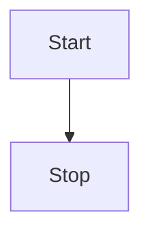

# vitepress-plugin-mermaid

Add mermaid support for Vitepress.
It detects any dark theme that are set in body as long as it has dark in the name

## Install

```bash
npm i vitepress-plugin-mermaid -s
```

## Setup it up

Add plugin

```js
//.vite.config.ts
import { defineConfig } from "vite";
import { MermaidPlugin } from "vitepress-plugin-mermaid";

export default defineConfig({
  plugins: [MermaidPlugin()],
});
```

Add markdown

```js
// .vitepress/config.js

import MermaidPlugin from "vitepress-plugin-mermaid";

module.exports = {
  ...
  markdown: {
    config: MermaidPlugin,
  },
  ...
}
```

Use in any Markdown file

````md
<!---any-file.md-->


````
