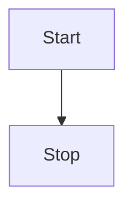

# vitepress-plugin-mermaid

Add mermaid support for Vitepress.
It detects any dark theme that are set in body as long as it has dark in the name

See the [docs 📕](https://emersonbottero.github.io/vitepress-plugin-mermaid/)  
and a [complex example 😎](https://emersonbottero.github.io/vitepress-plugin-mermaid/guide/more-examples.html#render)

## Install

```bash
npm i vitepress-plugin-mermaid mermaid @mermaid-js/mermaid-mindmap -D
```

## Setup it up

Add wrapper

```js
// .vitepress/config.js
import { withMermaid } from "vitepress-plugin-mermaid";

export default withMermaid({
  // your existing vitepress config...
});
```

Use in any Markdown file

````md
<!---any-file.md-->


````
