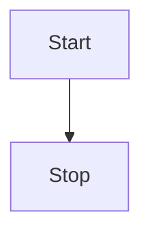

# vitepress-plugin-mermaid

Add mermaid support for Vitepress.
It detects any dark theme that are set in body as long as it has dark in the name

[//]: # (See the [docs 📕]&#40;https://emersonbottero.github.io/vitepress-plugin-mermaid/&#41;  )

[//]: # (and a [complex example 😎]&#40;https://emersonbottero.github.io/vitepress-plugin-mermaid/guide/more-examples.html#render&#41;)

## Install

```bash

npm i @alt-point/vitepress-plugin-mermaid mermaid @mermaid-js/mermaid-mindmap -D

// or 

yarn add -D @alt-point/vitepress-plugin-mermaid mermaid @mermaid-js/mermaid-mindmap
```

## Setup it up

Add wrapper

```js

// .vitepress/config.js
import { withMermaid } from '@alt-point/vitepress-plugin-mermaid'

export default withMermaid({
  // your existing vitepress config...
});

```

Use in any Markdown file

````md
<!---any-file.md-->


````
