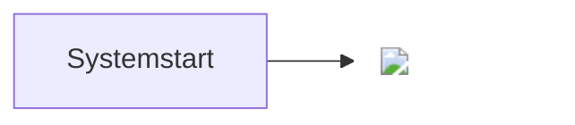
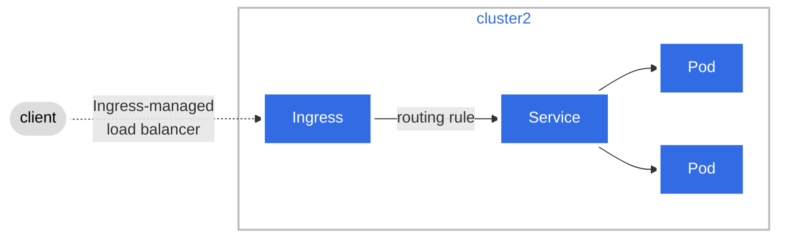
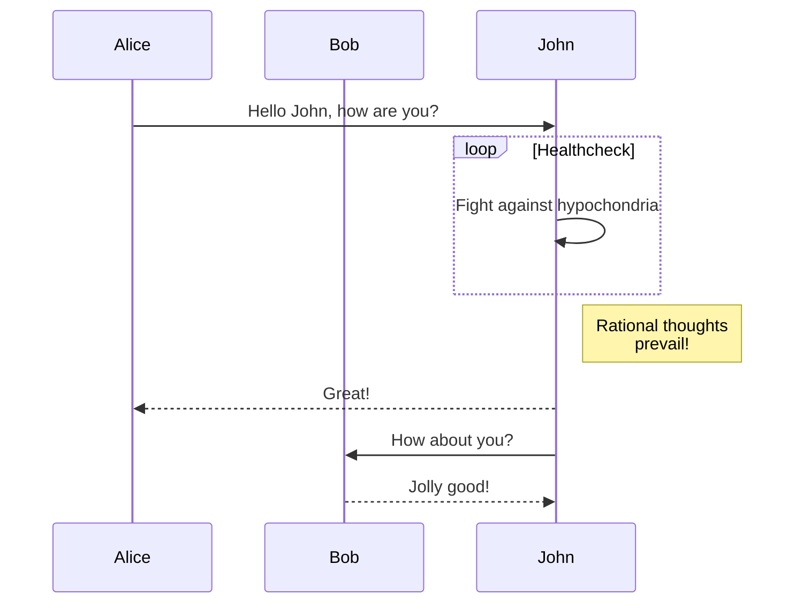
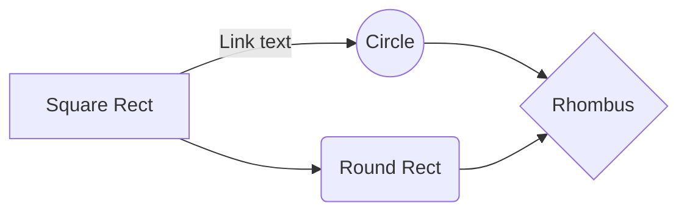
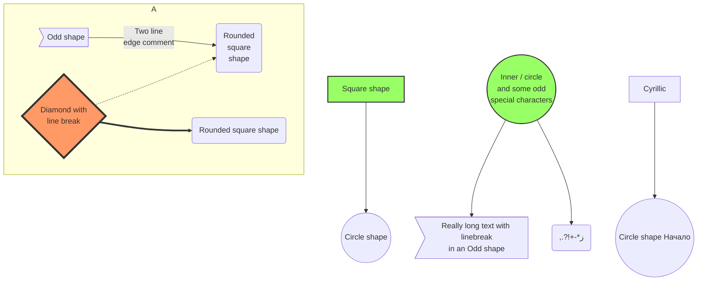
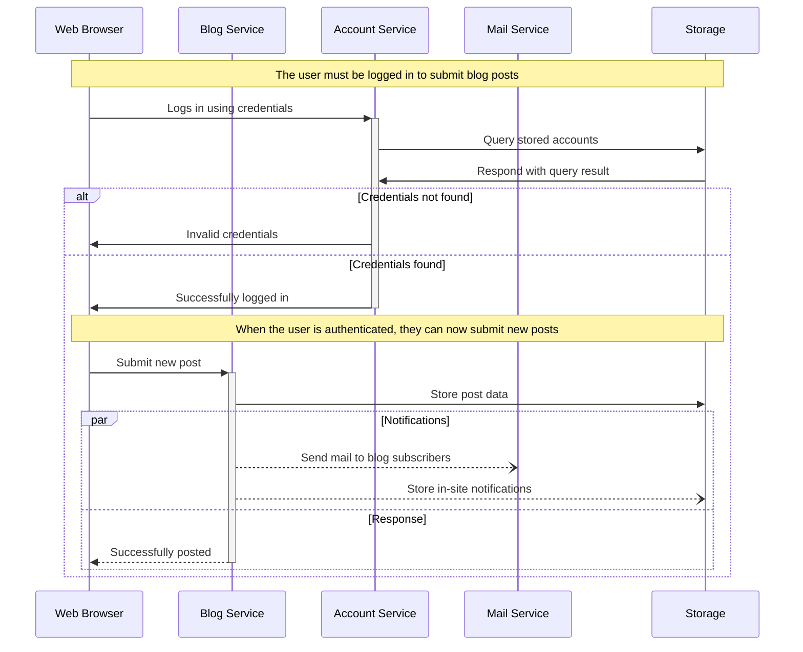

# Mermaid examples

```mermaid
graph LR; Systemstart-->SomeIcon(<img src='https://iconscout.com/ms-icon-310x310.png' width='60' />)
classDef icon fill:none, stroke: none
class SomeIcon icon
```

```mermaid
graph LR;
 client([client])-. Ingress-managed <br> load balancer .->ingress[Ingress];
 ingress-->|routing rule|service[Service];
 subgraph cluster2
 ingress;
 service-->pod1[Pod];
 service-->pod2[Pod];
 end
 classDef plain fill:#ddd,stroke:#fff,stroke-width:4px,color:#000;
 classDef k8s fill:#326ce5,stroke:#fff,stroke-width:4px,color:#fff;
 classDef cluster fill:#fff,stroke:#bbb,stroke-width:2px,color:#326ce5;
 class ingress,service,pod1,pod2 k8s;
 class client plain;
 class cluster cluster;
```

### Using fences

```mermaid
sequenceDiagram
    participant Alice
    participant Bob
    Alice->>John: Hello John, how are you?
    loop Healthcheck
        John->>John: Fight against hypochondria
    end
    Note right of John: Rational thoughts <br/>prevail!
    John-->>Alice: Great!
    John->>Bob: How about you?
    Bob-->>John: Jolly good!
```

### Complex?

```mermaid
graph LR
    A[Square Rect] -- Link text --> B((Circle))
    A --> C(Round Rect)
    B --> D{Rhombus}
    C --> D
```

```mermaid
graph TB
    sq[Square shape] --> ci((Circle shape))

    subgraph A
        od>Odd shape]-- Two line<br/>edge comment --> ro
        di{Diamond with <br/> line break} -.-> ro(Rounded<br>square<br>shape)
        di==>ro2(Rounded square shape)
    end

    %% Notice that no text in shape are added here instead that is appended further down
    e --> od3>Really long text with linebreak<br>in an Odd shape]

    %% Comments after double percent signs
    e((Inner / circle<br>and some odd <br>special characters)) --> f(,.?!+-*ز)

    cyr[Cyrillic]-->cyr2((Circle shape Начало));

     classDef green fill:#9f6,stroke:#333,stroke-width:2px;
     classDef orange fill:#f96,stroke:#333,stroke-width:4px;
     class sq,e green
     class di orange
```

```mermaid
sequenceDiagram
    participant web as Web Browser
    participant blog as Blog Service
    participant account as Account Service
    participant mail as Mail Service
    participant db as Storage

    Note over web,db: The user must be logged in to submit blog posts
    web->>+account: Logs in using credentials
    account->>db: Query stored accounts
    db->>account: Respond with query result

    alt Credentials not found
        account->>web: Invalid credentials
    else Credentials found
        account->>-web: Successfully logged in

        Note over web,db: When the user is authenticated, they can now submit new posts
        web->>+blog: Submit new post
        blog->>db: Store post data

        par Notifications
            blog--)mail: Send mail to blog subscribers
            blog--)db: Store in-site notifications
        and Response
            blog-->>-web: Successfully posted
        end
    end
```
