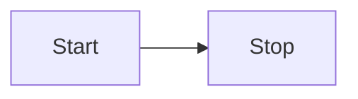

# Getting Started

This section will help you add mermaid support for VitePress.

::: warning
You can still highlight mermaid code with mmd as language
:::

## Install

```bash
npm i vitepress-plugin-mermaid mermaid @mermaid-js/mermaid-mindmap -D
```

## Setup it up

Add wrapper

```js
// .vitepress/config.js
import { defineConfig } from "vitepress";
import { withMermaid } from "@alt-point/vitepress-plugin-mermaid";

export default withMermaid(
  defineConfig({
    // your existing vitepress config...
    // optionally, you can pass MermaidConfig
    mermaid: {
      // refer https://mermaid.js.org/config/setup/modules/mermaidAPI.html#mermaidapi-configuration-defaults for options
    },
  })
);
```

Use in any Markdown file

Code with ```mmd

```mmd
flowchart LR
  Start --> Stop
```

Visualize with ```mermaid


