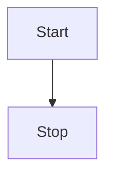

# Getting Started

This section will help you add mermaid support for VitePress.

## Install

```bash
npm i vitepress-plugin-mermaid -s
```

## Setup it up

Add component

```js
// .vitepress/theme/index.js
import DefaultTheme from "vitepress/theme";
import Mermaid from "vitepress-plugin-mermaid/Mermaid.vue";

export default {
  ...DefaultTheme,
  enhanceApp({ app }) {
    // register global components
    app.component("Mermaid", Mermaid);
  },
};
```

Add markdown

```js
// .vitepress/config.js

import MermaidPlugin from "vitepress-plugin-mermaid";

module.exports = {
  ...
  markdown: {
    config: MermaidPlugin,
  },
  ...
}
```

Use in any Markdown file

````md
<!---any-file.md-->


````
