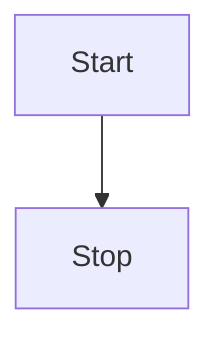

# Getting Started

This section will help you add mermaid support for VitePress.

## Install

```bash
npm i vitepress-plugin-mermaid -s
```

## Setup it up

Add plugin

```js
//.vite.config.ts
import { defineConfig } from "vite";
import { MermaidPlugin } from "vitepress-plugin-mermaid";

export default defineConfig({
  plugins: [MermaidPlugin()],
});
```

Add markdown

```js
// .vitepress/config.js

import { MermaidMarkdown } from "vitepress-plugin-mermaid";

module.exports = {
  ...
  markdown: {
    config: MermaidMarkdown,
  },
  ...
}
```

Use in any Markdown file

````md

````


