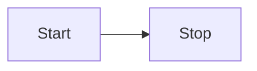

# Getting Started

This section will help you add mermaid support for VitePress.

::: warning
You can still highlight mermaid code with mmd as language
:::

## Install

```bash
npm i vitepress-plugin-mermaid -s
```

## Setup it up

Add plugin, it accepts an [MermaidConfig](https://mermaid-js.github.io/mermaid/#/Setup) as parameter.

```js
//vite.config.ts
import { defineConfig } from "vite";
import { MermaidPlugin } from "vitepress-plugin-mermaid";

export default defineConfig({
  plugins: [MermaidPlugin()],
});
```

Add markdown

```js
//.vitepress/config.js
import { MermaidMarkdown } from "vitepress-plugin-mermaid";

module.exports = {
  ...
  markdown: {
    config: MermaidMarkdown,
  },
  ...
}
```

Use in any Markdown file

Code with ```mmd

```mmd
flowchart LR
  Start --> Stop
```

Visualize with ```mermaid


