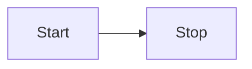

# Getting Started

This section will help you add mermaid support for VitePress.

::: warning
🚧 From version 2.0.11 and up charts that uses dates don't work in dev mod but still work after build!
You can still highlight mermaid code with mmd as language
:::

## Install

```bash
npm i vitepress-plugin-mermaid mermaid -D
```

## Setup it up

Add wrapper

```js
// .vitepress/config.js
import { withMermaid } from "vitepress-plugin-mermaid";

export default withMermaid({
    // your existing vitepress config...
    // optionally, you can pass MermaidConfig
    mermaid: {
      // refer https://mermaid.js.org/config/setup/modules/mermaidAPI.html#mermaidapi-configuration-defaults for options
    },
});
```

Use in any Markdown file

Code with ```mmd

```mmd
flowchart LR
  Start --> Stop
```

Visualize with ```mermaid


