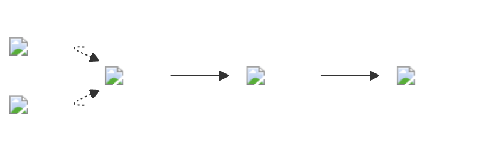
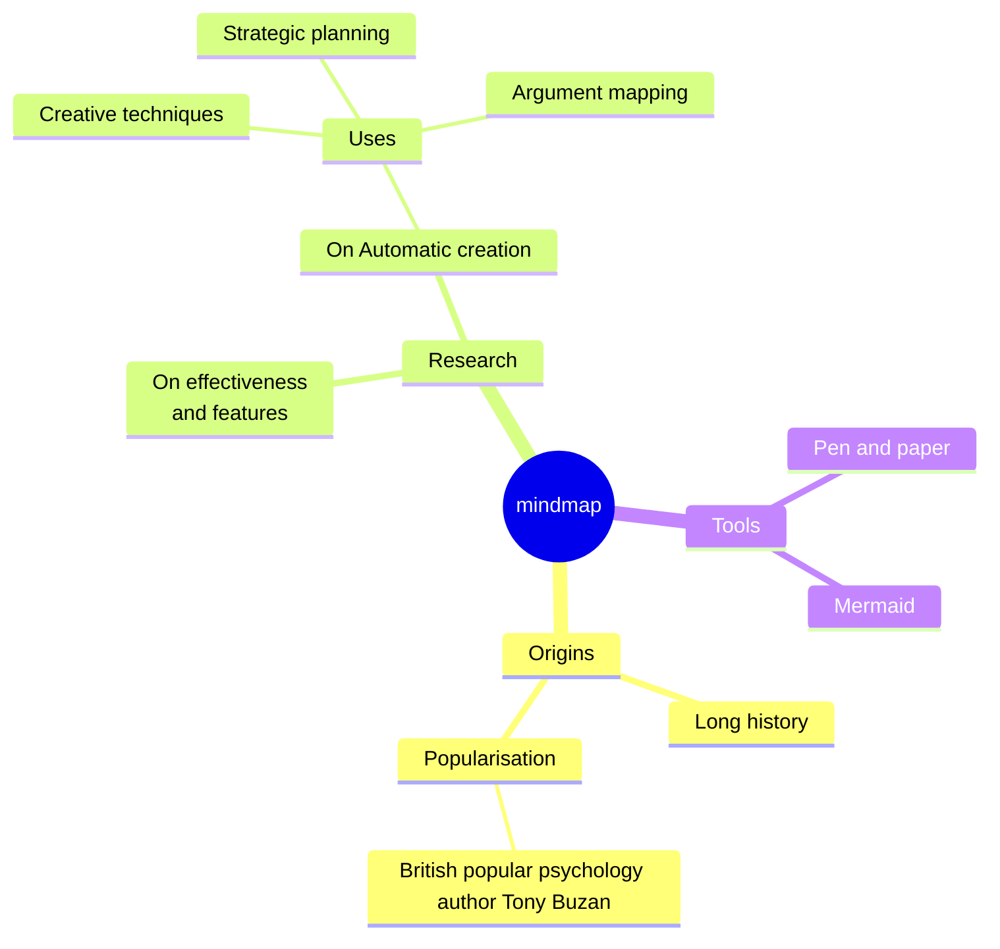
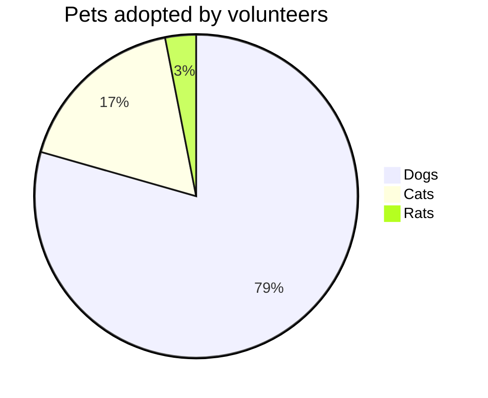

# Frontmatter Setup

💡 The theme for each page can be set in the frontmatter mermaidTheme parameter! But is only valid is light mode...

```
---
mermaidTheme: forest
title: A more complex example
---
```

# Code

Images and links can be used as well..

::: warning
You should place your image files in the public folder!
In case you set an base you should prefix images with it.  
:::


```mmd
graph LR;
    K([......................])-.->G((......................));
    H([......................])-.->G
    G-->A;
    A(......................)-->D(......................);
classDef img fill:none,color:transparent,stroke:none,borderRadius:50px
class G,D,A,K,H,B img
click K "https://kustomize.io/" _blank
click G "http://www.github.com" "This is a link" _blank
```

::: danger
Isolated images are nor rendering while using mermaid bigger than 9.1 [see the issue on github](https://github.com/mermaid-js/mermaid/issues/4023).  
The transparent wrapper `...........` is a workaround until it is fixed.
:::

# Render

In light mode the arrows are green since we are using forest here  
Kustomize and github are links in here!




<!-- <script>
  import mindmap from "@mermaid-js/mermaid-mindmap"
</script> -->

## Mindmap supported

```mmd
mindmap
  root((mindmap))
    Origins
      Long history
      ::icon(fa fa-book)
      Popularisation
        British popular psychology author Tony Buzan
    Research
      On effectiveness<br/>and features
      On Automatic creation
        Uses
            Creative techniques
            Strategic planning
            Argument mapping
    Tools
      Pen and paper
      Mermaid
```



## Pie

```mmd
pie title Pets adopted by volunteers
  "Dogs" : 386
  "Cats" : 85
  "Rats" : 15
```



<style>
  #git {
    border-radius: 50px;
  }

  #helm,
  .dark #git{
    transform: scale(1.5);
  }

  .dark #helm {
    filter: brightness(1.5);
  }
</style>
