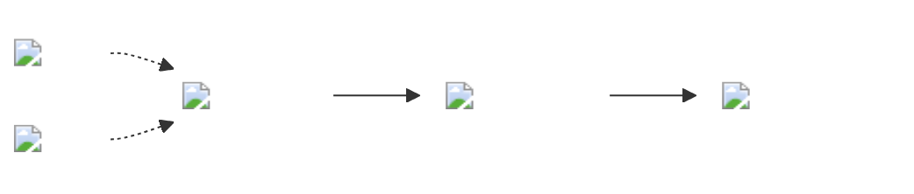

# Frontmatter Setup

💡 The theme for each page can be set in the frontmatter mermaidTheme parameter! But is only valid is light mode...

```
---
mermaidTheme: forest
title: A more complex example
---
```

# Code

Images and links can be used as well..

::: warning
You should place your image files in the public folder!
:::

````


````

# Render

In lith mode the arrows are green since we are using forest here  
Kustomize and github are links in here!


<style>
  #git {
    border-radius: 50px;
  }

  #helm,
  .dark #git{
    transform: scale(1.5);
  }

  .dark #helm {
    filter: brightness(1.5);
  }
</style>
